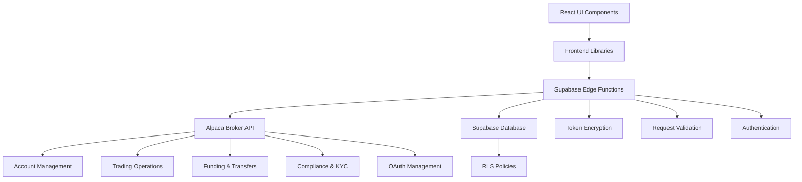

# Design Document

## Overview

This design document outlines the implementation of all missing Alpaca Broker API endpoints to complete LeadTrade's integration with Alpaca Markets. The implementation follows a layered architecture with Supabase Edge Functions as secure API proxies, TypeScript type definitions for all endpoints, and React components for UI integration.

## Architecture

### System Architecture



### Component Organization

```
supabase/functions/
├── alpaca-account/           # Account management
├── alpaca-documents/         # Document upload/download
├── alpaca-funding/           # ACH, wire transfers
├── alpaca-funding-wallets/   # Multi-currency funding
├── alpaca-trading-config/    # Trading configurations
├── alpaca-options-contracts/ # Options contracts
├── alpaca-options-exercise/  # Options exercise
├── alpaca-journals/          # Internal transfers
├── alpaca-events/            # SSE event streams
├── alpaca-corporate-actions/ # Corporate action announcements
├── alpaca-watchlists/        # Watchlist management
├── alpaca-oauth/             # OAuth client management (NEW)
└── _shared/
    ├── alpaca-client.ts      # Shared Alpaca API client
    ├── auth.ts               # Authentication utilities
    ├── cors.ts               # CORS handling
    └── response.ts           # Response formatting

src/
├── lib/
│   ├── alpaca-oauth.ts            # OAuth client library (calls Edge Functions)
│   └── validation/
│       └── alpaca-schemas.ts      # Zod validation schemas
├── types/
│   └── alpaca.ts                  # TypeScript type definitions
└── components/
    ├── account/
    │   ├── DocumentUpload.tsx     # Document management UI
    │   ├── BankLinking.tsx        # Bank account linking
    │   └── TradingConfig.tsx      # Trading configuration
    ├── funding/
    │   ├── ACHTransfer.tsx        # ACH transfer UI
    │   ├── WireTransfer.tsx       # Wire transfer UI
    │   └── CryptoFunding.tsx      # Crypto deposit/withdrawal
    ├── options/
    │   ├── OptionsChain.tsx       # Options contract browser
    │   └── OptionsExercise.tsx    # Exercise options UI
    └── compliance/
        ├── KYCUpload.tsx          # KYC document upload
        └── PDTStatus.tsx          # PDT status display
```

## Components and Interfaces

### 1. Account Management APIs

#### Enhanced Account Operations
```typescript
interface AccountUpdateRequest {
  contact?: {
    email_address?: string;
    phone_number?: string;
    street_address?: string[];
    city?: string;
    state?: string;
    postal_code?: string;
  };
  identity?: {
    given_name?: string;
    family_name?: string;
    date_of_birth?: string;
    country_of_citizenship?: string;
    funding_source?: string[];
  };
  disclosures?: {
    is_control_person?: boolean;
    is_affiliated_exchange_or_finra?: boolean;
    is_politically_exposed?: boolean;
    immediate_family_exposed?: boolean;
  };
  trusted_contact?: {
    given_name?: string;
    family_name?: string;
    email_address?: string;
  };
}

interface OptionsApprovalRequest {
  level: number; // 0-3
}

interface AccountActivity {
  id: string;
  account_id: string;
  activity_type: string;
  date: string;
  net_amount: string;
  description: string;
  status: string;
}
```

### 2. Document Management

#### Document Upload/Download
```typescript
interface DocumentUpload {
  document_type: 'identity_verification' | 'address_verification' | 'w8ben' | 'other';
  document_sub_type?: string;
  content: string; // base64 encoded
  mime_type: 'application/pdf' | 'image/jpeg' | 'image/png';
}

interface Document {
  id: string;
  document_type: string;
  document_sub_type?: string;
  content: string; // URL for download
  created_at: string;
}
```

### 3. Bank and ACH Management

#### Bank Relationships
```typescript
interface BankRelationship {
  id: string;
  name: string;
  bank_code: string;
  bank_code_type: 'aba' | 'bic';
  account_number: string;
  country?: string;
  state_province?: string;
  postal_code?: string;
  city?: string;
  street_address?: string;
}

interface ACHRelationship {
  id: string;
  account_id: string;
  status: 'queued' | 'approved' | 'pending' | 'sent_to_clearing' | 'rejected' | 'canceled';
  account_owner_name: string;
  bank_account_type: 'checking' | 'savings';
  bank_account_number: string;
  bank_routing_number: string;
  nickname?: string;
  processor_token?: string; // For Plaid integration
}
```

### 4. Transfer Operations

#### Transfer Types
```typescript
interface TransferRequest {
  transfer_type: 'ach' | 'wire' | 'sandbox';
  amount: string;
  direction: 'INCOMING' | 'OUTGOING';
  timing?: 'immediate' | 'next_day';
  relationship_id?: string;
  bank_id?: string;
  additional_information?: string;
  fee_payment_method?: 'user' | 'invoice';
}

interface Transfer {
  id: string;
  account_id: string;
  type: string;
  status: 'queued' | 'pending' | 'sent_to_clearing' | 'approved' | 'canceled' | 'rejected';
  amount: string;
  direction: string;
  created_at: string;
  updated_at: string;
  expires_at?: string;
}
```

### 5. Trading Configuration

#### Configuration Options
```typescript
interface TradingConfiguration {
  dtbp_check: 'entry' | 'exit' | 'both';
  trade_confirm_email: 'all' | 'none';
  suspend_trade: boolean;
  no_shorting: boolean;
  fractional_trading: boolean;
  max_margin_multiplier: string;
  pdt_check: 'entry' | 'exit' | 'both';
  ptp_no_exception_entry: boolean;
  max_options_trading_level: number;
}
```

### 6. Options Trading

#### Options Contracts
```typescript
interface OptionContract {
  id: string;
  symbol: string;
  name: string;
  status: 'active' | 'inactive';
  tradable: boolean;
  expiration_date: string;
  underlying_symbol: string;
  underlying_asset_id: string;
  type: 'call' | 'put';
  style: 'american' | 'european';
  strike_price: string;
  size: string;
  root_symbol: string;
  open_interest?: string;
  close_price?: string;
}

interface OptionExerciseRequest {
  symbol_or_contract_id: string;
}
```

### 7. Corporate Actions

#### Corporate Action Announcement
```typescript
interface CorporateAction {
  id: string;
  corporate_action_id: string;
  ca_type: 'dividend' | 'merger' | 'spinoff' | 'split';
  ca_sub_type: string;
  initiating_symbol: string;
  initiating_original_cusip: string;
  target_symbol?: string;
  ex_date: string;
  record_date: string;
  payable_date: string;
  cash?: string;
  old_rate?: string;
  new_rate?: string;
}
```

### 8. Event Streaming (SSE)

#### SSE Connection Management
```typescript
interface SSEConnection {
  url: string;
  since?: string;
  until?: string;
  since_id?: string;
  until_id?: string;
}

interface TradeEvent {
  event: 'fill' | 'partial_fill' | 'canceled' | 'rejected';
  order: Order;
  timestamp: string;
  execution_id?: string;
  price?: string;
  qty?: string;
}
```

### 9. Journal Operations

#### Journal Types
```typescript
interface JournalRequest {
  entry_type: 'JNLC' | 'JNLS'; // Cash or Securities
  from_account: string;
  to_account: string;
  amount?: string; // For JNLC
  symbol?: string; // For JNLS
  qty?: string; // For JNLS
  description?: string;
}

interface BatchJournalRequest {
  entry_type: 'JNLC';
  from_account?: string; // For one-to-many
  to_account?: string; // For many-to-one
  entries: Array<{
    from_account?: string;
    to_account?: string;
    amount: string;
  }>;
  description?: string;
}
```

### 10. Instant Funding (JIT)

#### JIT Operations
```typescript
interface InstantFundingRequest {
  account_no: string;
  source_account_no: string;
  amount: string;
}

interface InstantFunding {
  id: string;
  amount: string;
  account_no: string;
  source_account_no: string;
  status: 'pending' | 'approved' | 'settled' | 'canceled';
  system_date: string;
  deadline: string;
  total_interest: string;
  remaining_payable: string;
  interests: Interest[];
  fees: Fee[];
}
```

## Data Models

### Database Schema Extensions

```sql
-- Document storage metadata
CREATE TABLE account_documents (
  id UUID DEFAULT gen_random_uuid() PRIMARY KEY,
  account_id UUID REFERENCES user_profiles(id),
  alpaca_document_id TEXT,
  document_type TEXT NOT NULL,
  document_sub_type TEXT,
  mime_type TEXT,
  uploaded_at TIMESTAMP WITH TIME ZONE DEFAULT NOW(),
  status TEXT DEFAULT 'pending'
);

-- Bank relationships
CREATE TABLE bank_relationships (
  id UUID DEFAULT gen_random_uuid() PRIMARY KEY,
  account_id UUID REFERENCES user_profiles(id),
  alpaca_bank_id TEXT UNIQUE,
  bank_name TEXT,
  account_number_last4 TEXT,
  status TEXT,
  created_at TIMESTAMP WITH TIME ZONE DEFAULT NOW()
);

-- ACH relationships
CREATE TABLE ach_relationships (
  id UUID DEFAULT gen_random_uuid() PRIMARY KEY,
  account_id UUID REFERENCES user_profiles(id),
  alpaca_ach_id TEXT UNIQUE,
  bank_account_type TEXT,
  nickname TEXT,
  status TEXT,
  created_at TIMESTAMP WITH TIME ZONE DEFAULT NOW()
);

-- Transfer history
CREATE TABLE transfers (
  id UUID DEFAULT gen_random_uuid() PRIMARY KEY,
  account_id UUID REFERENCES user_profiles(id),
  alpaca_transfer_id TEXT UNIQUE,
  transfer_type TEXT NOT NULL,
  direction TEXT NOT NULL,
  amount DECIMAL(15,2),
  status TEXT,
  created_at TIMESTAMP WITH TIME ZONE DEFAULT NOW(),
  completed_at TIMESTAMP WITH TIME ZONE
);

-- Options positions
CREATE TABLE options_positions (
  id UUID DEFAULT gen_random_uuid() PRIMARY KEY,
  account_id UUID REFERENCES user_profiles(id),
  contract_id TEXT NOT NULL,
  symbol TEXT NOT NULL,
  quantity DECIMAL(10,4),
  avg_entry_price DECIMAL(10,4),
  current_price DECIMAL(10,4),
  unrealized_pl DECIMAL(15,2),
  updated_at TIMESTAMP WITH TIME ZONE DEFAULT NOW()
);

-- Watchlists
CREATE TABLE watchlists (
  id UUID DEFAULT gen_random_uuid() PRIMARY KEY,
  account_id UUID REFERENCES user_profiles(id),
  alpaca_watchlist_id TEXT UNIQUE,
  name TEXT NOT NULL,
  created_at TIMESTAMP WITH TIME ZONE DEFAULT NOW(),
  updated_at TIMESTAMP WITH TIME ZONE DEFAULT NOW()
);

CREATE TABLE watchlist_assets (
  watchlist_id UUID REFERENCES watchlists(id) ON DELETE CASCADE,
  symbol TEXT NOT NULL,
  added_at TIMESTAMP WITH TIME ZONE DEFAULT NOW(),
  PRIMARY KEY (watchlist_id, symbol)
);

-- Corporate actions tracking
CREATE TABLE corporate_actions (
  id UUID DEFAULT gen_random_uuid() PRIMARY KEY,
  alpaca_ca_id TEXT UNIQUE,
  ca_type TEXT NOT NULL,
  symbol TEXT NOT NULL,
  ex_date DATE,
  record_date DATE,
  payable_date DATE,
  details JSONB,
  created_at TIMESTAMP WITH TIME ZONE DEFAULT NOW()
);

-- KYC status tracking
CREATE TABLE kyc_submissions (
  id UUID DEFAULT gen_random_uuid() PRIMARY KEY,
  account_id UUID REFERENCES user_profiles(id),
  provider_name TEXT,
  status TEXT,
  risk_level TEXT,
  submitted_at TIMESTAMP WITH TIME ZONE DEFAULT NOW(),
  completed_at TIMESTAMP WITH TIME ZONE
);
```

## Error Handling

### API Error Responses
```typescript
interface AlpacaError {
  code: number;
  message: string;
  details?: Record<string, any>;
}

// Error handling wrapper
async function handleAlpacaRequest<T>(
  request: () => Promise<T>
): Promise<{ data?: T; error?: AlpacaError }> {
  try {
    const data = await request();
    return { data };
  } catch (error) {
    if (error.response) {
      return {
        error: {
          code: error.response.status,
          message: error.response.data.message || 'API request failed',
          details: error.response.data
        }
      };
    }
    return {
      error: {
        code: 500,
        message: 'Internal server error',
        details: { originalError: error.message }
      }
    };
  }
}
```

### Validation Errors
- Use Zod schemas for all request/response validation
- Return 400 Bad Request for validation failures
- Provide detailed field-level error messages

### Rate Limiting
- Implement exponential backoff for 429 responses
- Queue requests when rate limit is approached
- Display rate limit status to users

## Testing Strategy

### Unit Tests
- Test all API client functions with mocked responses
- Test Zod validation schemas with valid/invalid data
- Test error handling and edge cases

### Integration Tests
- Test complete API flows (create account → fund → trade)
- Test SSE connection management and reconnection
- Test batch operations (journals, transfers)

### End-to-End Tests
- Test document upload and download flows
- Test bank linking and ACH transfer flows
- Test options trading and exercise flows
- Test watchlist management

## Security Considerations

### Token Management
- Store Alpaca tokens encrypted in Supabase
- Rotate tokens on security events
- Implement token refresh logic

### Data Protection
- Never log sensitive data (SSN, account numbers)
- Encrypt documents at rest
- Use HTTPS for all API communications

### Access Control
- Enforce RLS policies on all database tables
- Validate user ownership of resources
- Implement rate limiting per user

## Performance Optimization

### Caching Strategy
- Cache option contract data (5-minute TTL)
- Cache corporate action announcements (1-hour TTL)
- Cache watchlist data (client-side)

### Batch Operations
- Use batch journal APIs for multiple transfers
- Batch document uploads when possible
- Implement request queuing for high-volume operations

### SSE Optimization
- Implement connection pooling
- Use heartbeat to detect stale connections
- Implement automatic reconnection with backoff

## UI Integration Points

### Account Settings Page
- Document upload section
- Bank account linking
- Trading configuration panel
- KYC status display
- PDT status and removal

### Trading Dashboard
- Options chain browser
- Watchlist management
- Corporate action notifications
- Real-time event feed

### Funding Page
- ACH transfer interface
- Wire transfer form
- Crypto funding (deposit/withdrawal)
- Transfer history

### Portfolio Page
- Options positions display
- Rebalancing controls
- Performance reporting
- Cash interest display

## Migration Strategy

### Phase 1: Core APIs (Week 1-2)
- Account management completion
- Document management
- Bank and ACH relationships

### Phase 2: Trading Features (Week 3-4)
- Options trading
- Trading configurations
- Watchlists
- Corporate actions

### Phase 3: Funding (Week 5-6)
- Transfer operations
- Instant funding (JIT)
- Multi-currency wallets
- Crypto funding

### Phase 4: Advanced Features (Week 7-8)
- Event streaming (SSE)
- Journal operations
- Rebalancing API
- Reporting API

### Phase 5: Compliance & Polish (Week 9-10)
- KYC/CIP integration
- OAuth implementation
- UI integration
- Testing and bug fixes

### Phase 6: Cleanup (Week 11)
- Remove deprecated APIs
- Code consolidation
- Documentation updates
- Performance optimization
