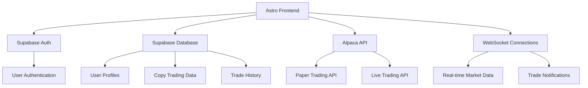

# Design Document

## Overview

LeadTrade is a copy trading platform built on Astro with React components, integrating Supabase for user management and Alpaca API for trade execution. The system enables experienced traders to share their strategies while allowing novice traders to automatically replicate successful trades with customizable allocation percentages.

## Architecture

### High-Level Architecture



### Technology Stack

- **Frontend**: Astro with React components, TypeScript
- **UI Library**: shadcn/ui with Tailwind CSS
- **Backend**: Supabase (Authentication, Database, Real-time)
- **Trading API**: Alpaca Markets API
- **Real-time**: WebSocket connections to Alpaca
- **Styling**: CSS custom properties for theme customization

## Components and Interfaces

### Core Components

#### 1. Authentication System
- **SignUpForm**: Enhanced with Alpaca account creation
- **SignInForm**: OAuth integration (Google, Apple)
- **ProtectedRoute**: Route protection with Supabase auth

#### 2. Trading Interface
- **TradingDashboard**: Main trading interface with mode toggle
- **TradeForm**: Enhanced with options trading support
- **PortfolioChart**: Real-time portfolio visualization
- **RealTimeMarketData**: WebSocket-powered market data

#### 3. Copy Trading System
- **Leaderboard**: Displays available traders with performance metrics
- **FollowerManagement**: Subscription and allocation management
- **CopyTradeExecutor**: Handles proportional trade execution
- **TradeHistory**: Shows original and copied trades

#### 4. Theme System
- **ThemeCustomizer**: Color picker and theme management
- **ThemeProvider**: CSS custom property management

### API Interfaces

#### Supabase Database Schema

```sql
-- Users table (extends Supabase auth.users)
CREATE TABLE user_profiles (
  id UUID REFERENCES auth.users(id) PRIMARY KEY,
  alpaca_account_id TEXT,
  alpaca_access_token TEXT ENCRYPTED,
  alpaca_refresh_token TEXT ENCRYPTED,
  is_paper_trading BOOLEAN DEFAULT true,
  share_trades BOOLEAN DEFAULT false,
  show_asset_amounts BOOLEAN DEFAULT false,
  theme_color TEXT DEFAULT '#ef4444',
  created_at TIMESTAMP WITH TIME ZONE DEFAULT NOW(),
  updated_at TIMESTAMP WITH TIME ZONE DEFAULT NOW()
);

-- Leader-Follower relationships
CREATE TABLE copy_trading_subscriptions (
  id UUID DEFAULT gen_random_uuid() PRIMARY KEY,
  follower_id UUID REFERENCES user_profiles(id),
  leader_id UUID REFERENCES user_profiles(id),
  allocation_percentage DECIMAL(5,2) CHECK (allocation_percentage > 0 AND allocation_percentage <= 100),
  is_active BOOLEAN DEFAULT true,
  created_at TIMESTAMP WITH TIME ZONE DEFAULT NOW(),
  UNIQUE(follower_id, leader_id)
);

-- Trade execution history
CREATE TABLE trade_executions (
  id UUID DEFAULT gen_random_uuid() PRIMARY KEY,
  original_trade_id TEXT, -- Alpaca order ID
  leader_id UUID REFERENCES user_profiles(id),
  symbol TEXT NOT NULL,
  side TEXT NOT NULL, -- 'buy' or 'sell'
  quantity DECIMAL(10,4),
  price DECIMAL(10,4),
  trade_type TEXT NOT NULL, -- 'stock' or 'option'
  option_details JSONB, -- For options: strike, expiration, type
  portfolio_percentage DECIMAL(5,2),
  executed_at TIMESTAMP WITH TIME ZONE DEFAULT NOW()
);

-- Copied trades
CREATE TABLE copied_trades (
  id UUID DEFAULT gen_random_uuid() PRIMARY KEY,
  original_trade_id UUID REFERENCES trade_executions(id),
  follower_id UUID REFERENCES user_profiles(id),
  alpaca_order_id TEXT,
  quantity DECIMAL(10,4),
  allocated_amount DECIMAL(10,2),
  execution_status TEXT DEFAULT 'pending',
  error_message TEXT,
  executed_at TIMESTAMP WITH TIME ZONE DEFAULT NOW()
);
```

#### Alpaca API Integration

```typescript
interface AlpacaConfig {
  baseUrl: string;
  dataUrl: string;
  wsUrl: string;
  keyId: string;
  secretKey: string;
}

interface TradingModeConfig {
  paper: AlpacaConfig;
  live: AlpacaConfig;
}

interface TradeExecution {
  symbol: string;
  side: 'buy' | 'sell';
  quantity: number;
  type: 'market' | 'limit';
  timeInForce: 'day' | 'gtc';
  limitPrice?: number;
  tradeType: 'stock' | 'option';
  optionDetails?: {
    strike: number;
    expiration: string;
    optionType: 'call' | 'put';
  };
}
```

## Data Models

### User Profile Model
```typescript
interface UserProfile {
  id: string;
  alpacaAccountId: string;
  isPaperTrading: boolean;
  shareTrades: boolean;
  showAssetAmounts: boolean;
  themeColor: string;
  createdAt: Date;
  updatedAt: Date;
}
```

### Copy Trading Subscription Model
```typescript
interface CopyTradingSubscription {
  id: string;
  followerId: string;
  leaderId: string;
  allocationPercentage: number;
  isActive: boolean;
  createdAt: Date;
}
```

### Trade Execution Model
```typescript
interface TradeExecution {
  id: string;
  originalTradeId: string;
  leaderId: string;
  symbol: string;
  side: 'buy' | 'sell';
  quantity: number;
  price: number;
  tradeType: 'stock' | 'option';
  optionDetails?: OptionDetails;
  portfolioPercentage: number;
  executedAt: Date;
}

interface OptionDetails {
  strike: number;
  expiration: string;
  optionType: 'call' | 'put';
}
```

## Error Handling

### Authentication Errors
- **Supabase Auth Failure**: Redirect to sign-in with error message
- **Alpaca Account Creation Failure**: Rollback Supabase user, display detailed error
- **Token Refresh Failure**: Prompt for re-authentication

### Trading Errors
- **Insufficient Funds**: Skip trade, log event, notify user
- **API Rate Limiting**: Implement exponential backoff, queue trades
- **WebSocket Disconnection**: Auto-reconnect with exponential backoff
- **Invalid Trade Parameters**: Validate before submission, show user-friendly errors

### Copy Trading Errors
- **Leader Trade Failure**: Don't execute follower trades, log incident
- **Partial Execution**: Execute maximum possible amount, log shortfall
- **Allocation Overflow**: Prevent subscription if total > 100%

## Testing Strategy

### Unit Testing
- **Authentication Flow**: Test Supabase and Alpaca integration
- **Trade Execution Logic**: Test proportional calculations
- **Theme System**: Test CSS custom property updates
- **WebSocket Handlers**: Test connection management and data processing

### Integration Testing
- **End-to-End Copy Trading**: Test leader trade → follower execution flow
- **API Integration**: Test Alpaca API calls in both paper and live modes
- **Database Operations**: Test CRUD operations for all entities
- **Real-time Updates**: Test WebSocket message handling

### User Acceptance Testing
- **Registration Flow**: Test complete signup with Alpaca account creation
- **Copy Trading Setup**: Test leader selection and allocation
- **Trade Execution**: Test both stock and options trading
- **Theme Customization**: Test color selection and persistence

## Security Considerations

### Data Protection
- **Token Encryption**: Encrypt Alpaca tokens at rest
- **PII Exclusion**: Never store SSN or sensitive personal data
- **API Key Management**: Separate paper/live credentials
- **Session Management**: Secure token refresh and logout

### Access Control
- **Route Protection**: Authenticate all trading endpoints
- **Data Isolation**: Users can only access their own data
- **Admin Controls**: Separate admin interface for platform management
- **Rate Limiting**: Prevent API abuse and excessive trading

## Performance Optimization

### Static Generation
- **Landing Pages**: Generate static pages for marketing content
- **Leaderboard**: Cache leaderboard data, update periodically
- **Market Data**: Use WebSocket for real-time updates on static pages

### Caching Strategy
- **User Profiles**: Cache frequently accessed profile data
- **Market Data**: Cache market data with appropriate TTL
- **Trade History**: Paginate and cache historical data

### WebSocket Optimization
- **Connection Pooling**: Reuse connections across components
- **Message Filtering**: Only subscribe to relevant data streams
- **Reconnection Logic**: Implement robust reconnection with backoff

## Future Enhancements

### Mobile App Integration with Ionic

#### Native App Generation
- **Ionic Capacitor**: Integrate Ionic Capacitor to generate native Android and iOS apps from the existing web-based Astro application
- **Platform-Specific Features**: Leverage native device capabilities like push notifications, biometric authentication, and native navigation
- **App Store Distribution**: Package and distribute through Google Play Store and Apple App Store

#### Mobile-Optimized Features
- **Push Notifications**: Real-time trade alerts and copy trading notifications
- **Biometric Authentication**: Fingerprint and Face ID for secure app access
- **Offline Capabilities**: Cache essential data for limited offline functionality
- **Native Performance**: Optimize WebSocket connections and UI rendering for mobile devices

#### Implementation Approach
- **Capacitor Configuration**: Configure Capacitor to wrap the Astro build output
- **Native Plugin Integration**: Add plugins for device features (camera, notifications, secure storage)
- **Mobile UI Adaptations**: Ensure responsive design works optimally in native app context
- **App Store Compliance**: Implement necessary security and privacy features for app store approval