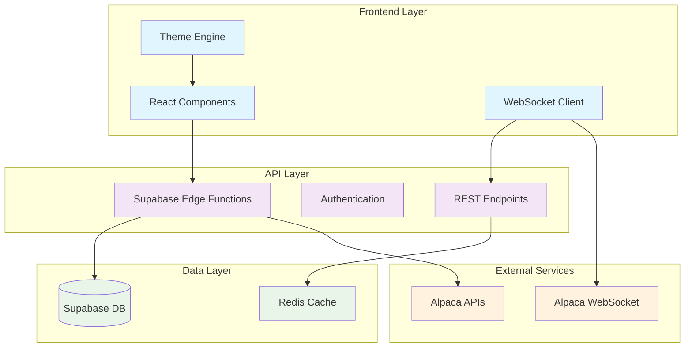
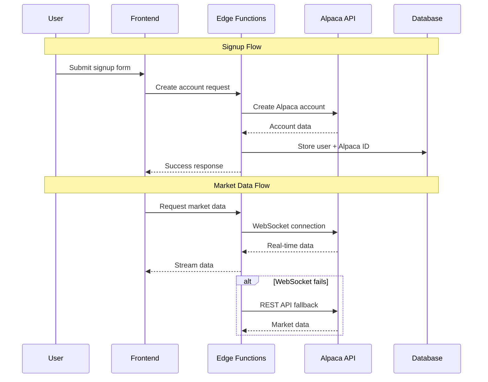

# Design Document

## Overview

This design document outlines the architecture and implementation approach for finalizing the LeadTrade MVP. The system focuses on seamless Alpaca integration, optimized data storage, reliable theming, robust market data delivery, and clean codebase organization.

## Architecture

### High-Level System Design



### Data Flow Architecture



## Components and Interfaces

### 1. Signup Integration Service

**Purpose**: Handle complete user onboarding with Alpaca account creation

**Key Components**:
- `AlpacaSignupService`: Manages Alpaca account creation
- `UserDataService`: Handles user profile and preferences
- `TransactionManager`: Ensures atomic operations with rollback

**Interface**:
```typescript
interface SignupService {
  createUserWithAlpaca(userData: SignupData): Promise<SignupResult>
  rollbackFailedSignup(userId: string): Promise<void>
  validateAlpacaRequirements(data: SignupData): ValidationResult
}
```

### 2. Data Storage Optimization

**Purpose**: Minimize database storage while maintaining functionality

**Storage Strategy**:
- **Store**: User profiles, Alpaca account IDs, copy trading relationships
- **Don't Store**: Trade data, market data, portfolio positions
- **Cache**: Frequently accessed Alpaca data with TTL

**Database Schema**:
```sql
-- Essential tables only
users (id, email, created_at)
profiles (user_id, alpaca_account_id, preferences)
copy_trading_subscriptions (follower_id, leader_id, allocation)
alpaca_accounts (user_id, account_id, status)
```

### 3. Supabase Functions Implementation

**Required Functions** (based on PDF requirements):
- `create-alpaca-account`: Account creation with KYC
- `alpaca-funding`: Handle deposits/withdrawals
- `alpaca-orders`: Order management
- `alpaca-positions`: Position tracking
- `market-data-websocket`: Real-time market data
- `copy-trading-engine`: Trade replication logic

**Function Architecture**:
```typescript
interface EdgeFunction {
  handler: (request: Request) => Promise<Response>
  auth: AuthenticationMiddleware
  rateLimit: RateLimitMiddleware
  errorHandler: ErrorHandlingMiddleware
}
```

### 4. Theme Engine Redesign

**Purpose**: Fix theming persistence and authentication issues

**Current Issues**:
- Theme breaks after login/signup
- Inconsistent cookie handling
- Race conditions in theme loading

**Solution Architecture**:
```typescript
interface ThemeManager {
  loadTheme(): Theme
  saveTheme(theme: Theme): void
  applyTheme(theme: Theme): void
  resetToDefault(): void
}
```

**Implementation Strategy**:
- Use `document.cookie` directly for immediate persistence
- Apply theme before React hydration
- Implement theme loading in `<head>` script tag
- Add fallback mechanisms for failed theme loads

### 5. WebSocket Market Data with Fallback

**Purpose**: Ensure reliable market data delivery

**Architecture**:
```typescript
interface MarketDataService {
  connect(): Promise<WebSocketConnection>
  subscribe(symbols: string[]): void
  onData(callback: (data: MarketData) => void): void
  fallbackToREST(): void
}
```

**Fallback Strategy**:
1. Attempt WebSocket connection
2. Retry up to 3 times with exponential backoff
3. Fall back to REST API polling
4. Attempt WebSocket reconnection every 30 seconds

## Data Models

### User Account Model
```typescript
interface UserAccount {
  id: string
  email: string
  alpacaAccountId: string
  tradingMode: 'paper' | 'live'
  preferences: UserPreferences
  createdAt: Date
}
```

### Copy Trading Model
```typescript
interface CopyTradingSubscription {
  id: string
  followerId: string
  leaderId: string
  allocationPercentage: number
  isActive: boolean
  createdAt: Date
}
```

### Market Data Model
```typescript
interface MarketDataUpdate {
  symbol: string
  price: number
  volume: number
  timestamp: Date
  source: 'websocket' | 'rest'
}
```

## Error Handling

### Signup Error Handling
- **Alpaca Failure**: Prevent Supabase account creation
- **Supabase Failure**: Log orphaned Alpaca account for cleanup
- **Partial Failure**: Implement comprehensive rollback

### Market Data Error Handling
- **WebSocket Disconnect**: Automatic reconnection with backoff
- **API Rate Limits**: Implement queuing and retry logic
- **Data Corruption**: Validate and sanitize all incoming data

### Theme Error Handling
- **Cookie Failure**: Fall back to localStorage
- **Invalid Theme**: Reset to system default
- **Loading Errors**: Apply default theme immediately

## Testing Strategy

### Unit Testing
- All service functions with mocked dependencies
- Theme management logic
- WebSocket connection handling
- Data validation functions

### Integration Testing
- Complete signup flow end-to-end
- Market data WebSocket with fallback
- Copy trading subscription flow
- Database migration validation

### Performance Testing
- WebSocket connection stability
- Market data throughput
- Database query optimization
- Theme switching responsiveness

## Security Considerations

### Data Protection
- Encrypt sensitive user data (SSN, financial info)
- Use secure token storage for Alpaca credentials
- Implement proper session management

### API Security
- Rate limiting on all endpoints
- Input validation and sanitization
- Proper CORS configuration
- Authentication middleware on all protected routes

### Database Security
- Row Level Security (RLS) policies
- Encrypted connections
- Regular security audits
- Minimal data retention

## Performance Optimization

### Frontend Performance
- Lazy loading of trading components
- Efficient WebSocket connection pooling
- Optimized theme switching
- Minimal bundle size

### Backend Performance
- Connection pooling for database
- Caching frequently accessed data
- Efficient Alpaca API usage
- Optimized database queries

### Real-time Data Performance
- WebSocket connection reuse
- Efficient data serialization
- Client-side data caching
- Intelligent subscription management

## Deployment Strategy

### Database Migration
1. Create new clean migration files
2. Test migrations on staging environment
3. Backup existing data
4. Apply migrations with rollback plan

### Function Deployment
1. Deploy functions incrementally
2. Test each function individually
3. Monitor error rates and performance
4. Rollback capability for each function

### Frontend Deployment
1. Build and test theme fixes
2. Validate WebSocket functionality
3. Test signup flow end-to-end
4. Deploy with feature flags for gradual rollout