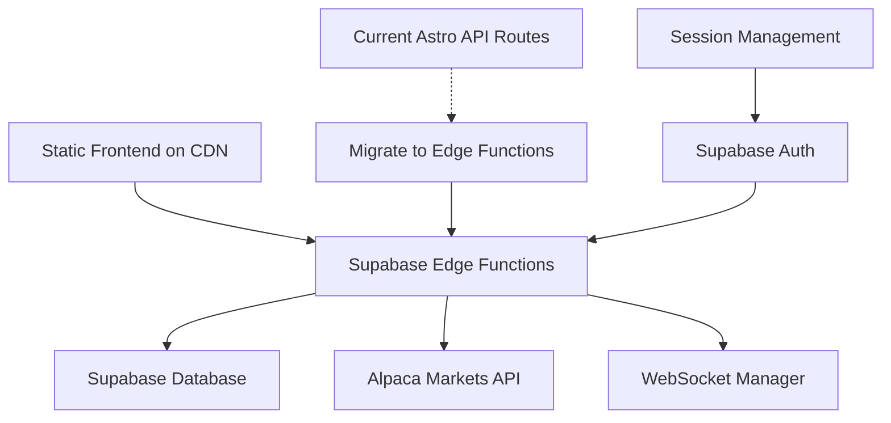

# Design Document

## Overview

This design outlines the migration of LeadTrade from Astro API routes to Supabase Edge Functions, enabling full static site generation while maintaining all existing functionality. The migration will create a serverless architecture where the frontend is deployed as static files to a CDN, and all dynamic operations are handled by Supabase Edge Functions.

## Architecture

### Current Architecture
- **Frontend**: Astro with React components
- **API Layer**: Astro API routes (`src/pages/api/`)
- **Database**: Supabase PostgreSQL
- **External APIs**: Alpaca Markets (Broker & Data APIs)
- **Deployment**: Server-side rendering required

### Target Architecture
- **Frontend**: Fully static Astro build deployed to CDN
- **API Layer**: Supabase Edge Functions (`supabase/functions/`)
- **Database**: Supabase PostgreSQL with RLS
- **External APIs**: Alpaca Markets via Edge Functions
- **Real-time**: WebSocket connections managed by Edge Functions
- **Deployment**: Static files + Supabase services only

### Migration Strategy



## Components and Interfaces

### 1. Supabase Edge Functions Structure

#### Core Trading Functions
- `alpaca-account/` - Account management and information
- `alpaca-orders/` - Order placement and management  
- `alpaca-positions/` - Portfolio positions tracking
- `alpaca-portfolio-history/` - Historical portfolio data
- `alpaca-assets/` - Available trading assets

#### Market Data Functions
- `market-quotes/` - Real-time stock quotes
- `market-bars/` - Historical price bars
- `market-websocket/` - WebSocket connection management
- `market-assets/` - Market asset information

#### Options Trading Functions
- `alpaca-options-orders/` - Options order management
- `alpaca-options-positions/` - Options positions tracking

#### User & Social Functions
- `user-profile/` - User profile management
- `leaderboard/` - Trading leaderboard data
- `copy-trading-subscriptions/` - Copy trading management (existing)

#### Authentication Functions
- `auth/` - Authentication handling (existing)
- `signup/` - User registration (existing)

### 2. WebSocket Management Architecture

#### Edge Function WebSocket Manager
```typescript
interface WebSocketManager {
  // Connection lifecycle
  connect(sessionToken: string): Promise<void>
  disconnect(sessionId: string): void
  
  // Subscription management
  subscribe(sessionId: string, symbols: string[]): void
  unsubscribe(sessionId: string, symbols: string[]): void
  
  // Data streaming
  broadcastQuote(symbol: string, data: QuoteData): void
  broadcastBar(symbol: string, data: BarData): void
}
```

#### Session-Based Connection Management
- Maintain persistent WebSocket connections per user session
- Use Supabase Auth tokens to validate sessions
- Automatic cleanup when sessions expire
- Reconnection logic with exponential backoff

### 3. Frontend Integration

#### Static Build Configuration
```typescript
// astro.config.mjs
export default defineConfig({
  output: 'static',
  integrations: [react()],
  vite: {
    define: {
      'import.meta.env.SUPABASE_FUNCTIONS_URL': JSON.stringify(process.env.SUPABASE_URL + '/functions/v1')
    }
  }
});
```

#### API Client Abstraction
```typescript
interface ApiClient {
  // Replace Astro API calls with Supabase Function calls
  get(endpoint: string, params?: Record<string, any>): Promise<Response>
  post(endpoint: string, data?: any): Promise<Response>
  put(endpoint: string, data?: any): Promise<Response>
  delete(endpoint: string): Promise<Response>
}
```

## Data Models

### Edge Function Request/Response Models

#### Standard Response Format
```typescript
interface EdgeFunctionResponse<T = any> {
  success: boolean
  data?: T
  error?: string
  message?: string
}
```

#### Authentication Context
```typescript
interface AuthContext {
  userId: string
  sessionToken: string
  isAuthenticated: boolean
  tradingMode: 'paper' | 'live'
}
```

#### WebSocket Message Types
```typescript
interface WebSocketMessage {
  type: 'quote' | 'bar' | 'trade' | 'status'
  symbol: string
  data: QuoteData | BarData | TradeData | StatusData
  timestamp: string
}
```

### Migration Data Mapping

#### Alpaca API Endpoints Mapping
```typescript
const ENDPOINT_MAPPING = {
  // Current Astro API -> New Edge Function
  '/api/alpaca/account' -> '/functions/v1/alpaca-account',
  '/api/alpaca/orders' -> '/functions/v1/alpaca-orders',
  '/api/alpaca/positions' -> '/functions/v1/alpaca-positions',
  '/api/market/quotes' -> '/functions/v1/market-quotes',
  '/api/market/bars' -> '/functions/v1/market-bars',
  '/api/market/websocket' -> '/functions/v1/market-websocket'
}
```

## Error Handling

### Edge Function Error Standards
```typescript
interface EdgeFunctionError {
  code: string
  message: string
  details?: any
  timestamp: string
}

const ERROR_CODES = {
  ALPACA_API_ERROR: 'ALPACA_API_ERROR',
  AUTHENTICATION_FAILED: 'AUTHENTICATION_FAILED',
  WEBSOCKET_CONNECTION_FAILED: 'WEBSOCKET_CONNECTION_FAILED',
  INVALID_REQUEST: 'INVALID_REQUEST',
  RATE_LIMIT_EXCEEDED: 'RATE_LIMIT_EXCEEDED'
}
```

### Error Response Handling
- Maintain identical error response formats from current API
- Add proper HTTP status codes for different error types
- Include detailed error logging for debugging
- Implement retry logic for transient failures

### WebSocket Error Handling
- Connection failure recovery with exponential backoff
- Session validation errors trigger re-authentication
- Data parsing errors logged without breaking connection
- Graceful degradation to REST API if WebSocket fails

## Testing Strategy

### Edge Function Testing
```typescript
// Test structure for each Edge Function
describe('alpaca-account Edge Function', () => {
  test('should return account data for authenticated user')
  test('should handle Alpaca API errors gracefully')
  test('should validate authentication tokens')
  test('should return proper error responses')
})
```

### Integration Testing
- Test Edge Function to Alpaca API integration
- Validate WebSocket connection management
- Test session-based authentication flow
- Verify error handling across all endpoints

### Static Build Testing
- Ensure all frontend functionality works with static build
- Test API client integration with Edge Functions
- Validate WebSocket connections from static frontend
- Performance testing for CDN deployment

### Migration Testing Strategy
1. **Parallel Testing**: Run both Astro API and Edge Functions simultaneously
2. **Feature Parity**: Validate identical responses from both systems
3. **Load Testing**: Ensure Edge Functions handle expected traffic
4. **Rollback Plan**: Maintain ability to revert to Astro API if needed

## Performance Considerations

### Edge Function Optimization
- Cold start minimization through shared dependencies
- Connection pooling for Alpaca API calls
- Caching strategies for frequently accessed data
- Efficient WebSocket connection management

### Static Frontend Benefits
- Faster initial page loads via CDN
- Reduced server costs (no SSR required)
- Better caching strategies
- Improved SEO and performance scores

### WebSocket Performance
- Single persistent connection per user session
- Efficient message broadcasting to multiple subscribers
- Automatic connection cleanup for inactive sessions
- Fallback to polling if WebSocket unavailable

## Security Considerations

### Authentication Flow
- Supabase Auth integration with Edge Functions
- HTTP-only cookies for session management
- Token validation on every Edge Function call
- Automatic session expiration handling

### API Security
- Rate limiting on Edge Functions
- Input validation using Zod schemas
- Secure credential storage in Supabase secrets
- CORS configuration for static frontend

### WebSocket Security
- Session-based WebSocket authentication
- Symbol subscription validation
- Connection limits per user
- Automatic disconnection on session expiry

## Deployment Strategy

### Phase 1: Edge Function Creation
1. Create all required Edge Functions
2. Implement authentication and error handling
3. Test individual function endpoints
4. Deploy to Supabase staging environment

### Phase 2: WebSocket Migration
1. Implement WebSocket manager in Edge Function
2. Create session-based connection handling
3. Test real-time data streaming
4. Validate connection lifecycle management

### Phase 3: Frontend Migration
1. Update API client to use Edge Functions
2. Test static build compatibility
3. Validate all features work with new backend
4. Performance testing and optimization

### Phase 4: Cleanup and Optimization
1. Remove unused Astro API routes
2. Clean up redundant code and dependencies
3. Optimize Edge Function performance
4. Final testing and deployment

## Rollback Plan

### Immediate Rollback
- Keep existing Astro API routes during migration
- Feature flag to switch between API systems
- Database rollback scripts if schema changes needed
- CDN configuration to serve from different origins

### Gradual Migration
- Migrate endpoints one by one
- A/B testing between old and new systems
- Monitor performance and error rates
- Rollback individual functions if issues arise